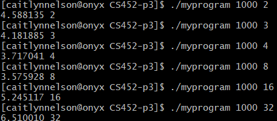
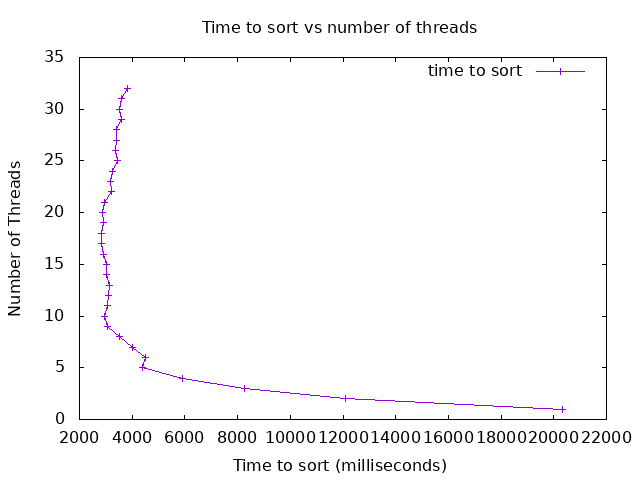
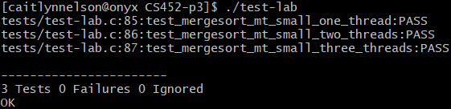

# CSC 452/552 Operations Systems
# Project 3 Threads
## Name: Caitlyn Nelson
## Bronco ID: 114108964
## Date:11/02/2024

# 1. Project Overview

We were tasked with taking an existing data structure that is not thread safe and wrapping it to use in a multi-threaded environment. This implementation is derived directly from the book "Introduction to Algorithms" by Cormen, Leiserson, Rivest, and Stein. My job was to wrap this algorithm so I can use it in a multi-threaded environment. 

The Learning Outcomes that apply are below:

1.4 Apply computer science theory and software development fundamentals to produce computing-based solutions. (ABET Outcome 6)

1.5 Use simple shell scripts and system tools to analyze process behavior

3.1 Analyze a complex computing problem and apply principles of computing and other relevant disciplines to identify solutions. (ABET Outcome 1)

3 Construct applications that utilize processes, threads, and synchronization primitives to solve problems requiring concurrent or parallel computation

3.2 Explore the effects of multiple threads operating on the same buffer

# 2. Project Management Plan
    a. Task 1 - Setup Repository: Initialize the repository that was to be used.

    b. Task 2 - Prepare the Repository: I had to copy and clone the repository for myself and then intialize all the starter code that was needed by copying the documentation and code from the given lab.h, lab.c, main.c and test-lab.c.

    b. Task 3 - Read the pthread documentation and Implement the header file lab.h in lab.c: Took a deep dive into the documentation to make sure that I understood what each function call was doing and how it was doing what its preposed purpose is. I had actually coded a version before that I found wasn't exactly multithreaded at first. Once I realized this, I spent about an hour recoding my entire mergesort_mt and parallel_sort. This then worked out much better and I was able to test my code properly which returned the expected results. It also gave me a deeper understanding of what I was expected to create behind the scenes to make this code work. I found out that for the program to be multithreaded you could keep track of the threads and their individual data separate so that later when you needed to merge them together after the join, the data on the size of the chunks is still accessible. At least this is how I implemented my code. I overall didn't find that I had any bugs with my project. It seemed to go more smoothly than the last two projects with bugs in your code that you accidentally create.

    d. Task 4 - Driver App: Once the coding part of the project was completed to my liking them I was able to begin testing my program. I found that it worked as expected in which the time for the first few threads was continually decreasing from 2 to 8 as you can from the below image. Then once you hit 16 and 32, you can see this increase in time which means that somewhere beyond threads input 8 and 16 you have where your optimal number of threads lie.

Driver App Screenshot: 

    e. Task 5 - Add Bash Files: This part of the project wasn't too complicated as I created both createplot.sh and graph.plt as new files updating each of their codes to what was provided in the instructions. Then I modified the createplot.sh on line 28 and line 36 changing the ./build/myprogram file name to ./myprogram. This was necessary as I need to reference my file within my particular file structure to be able to execute the code and generate the student plot and the data.dat. As you can see in my file structure, I have createplot.sh, data.dat, graph.plt, and student_plot.png which were all the files we either needed to manually create or were created by getting the bash files to run properly in this step.
    
    Here is the picture for the student_plot!

    f. Task 6 - Complete the Analysis: This last step was to complete an indepth analysis on the student plot that was created in the last step. You can find my analysis in the Analysis.md document within my project.
    
# 3. Project Deliveries
    a. How to compile and use my code?
    To compile this code run the command 'make clean' -> 'make'
    To run the program after make has been run -> './myprogram 1000 2' (Program runs and outputs time and number of threads used)
    To run the test-lab file after make has been run -> './test-lab' (All tests pass)

    b. Any self-modification?
    There are no self-modifications present within this code.

    c. Summary of Results.
    When the test-lab.c is run my code runs all the neccessary tests for the threaded program and passes all 3 with no memory leaks or issues. You can see this in the picure below:
Tests All Passes with No Memory Complications

    When the ./myprogram is run my code runs completely and returns the expected output as you can see below in this picture.
Results of Running ./myprogram from Driver App

    

# 4. Self-Reflection of Project 2
Overall, I think this was a decent project to mess with and learn about multithreaded programming and the advantages and disadvantages that come along with it. Initially, it took me a bit of time to understand what I was supposed to do considering the mergesort_mt and parallel sort. Initially, I first coded it in which I used the threads, but not implementing them correctly for the use of multithreading as I wasn't utilizing how many threads were input. It was very interesting cause at first I didn't notice anything as my program was running similar to the expected results and all the tests were passing. So this was a bit deceptive, however I noticed theh issue by walking back through my code and revising it. Then I recoded it for about an hour and implemented keeping track of the number of threads and their data individually which I do by having two arrays watch each of them separately. This worked really well as after pthread_join is run, if you keep track of the thread within the thread itself, you would no longer have access to the original size of the chunk of each thread. So this way I was able to maintain that information which made my final merge easier as I could merge one chunk with the next. After the coding for the project was complete and I was able to confirm that it was working correctly with the tests and outputs, I moved onto the bash files. I didn't really have much trouble with this. It took me a bit of time to make sure I understood what I was to do and then I executed the instructions. I thought this was a easier project than the last one as there isn't very much coding to do except for the first part. This project focuses more on doing something with the multithreaded program than just coding it. Overall, I had a decent time completing this project and was able to complete it within the timeframe for the project. I hope the last project goes as smoothly as this one.

# 5. Comments for Project 2 (optional)
Overall, I learned a lot as I usually do with these projects and was happy to complete it!

# 6. Use of AI for debugging (optional)
None