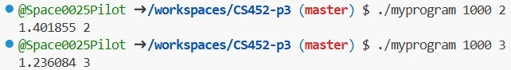

# CSC 452/552 Operations Systems
# Project 3 Threads
## Name: Caitlyn Nelson
## Bronco ID: 114108964
## Date:11/02/2024

# 1. Project Overview

We were tasked with taking an existing data structure that is not thread safe and wrapping it to use in a multi-threaded environment. This implementation is derived directly from the book "Introduction to Algorithms" by Cormen, Leiserson, Rivest, and Stein. My job was to wrap this algorithm so I can use it in a multi-threaded environment. 

The Learning Outcomes that apply are below:

1.4 Apply computer science theory and software development fundamentals to produce computing-based solutions. (ABET Outcome 6)

1.5 Use simple shell scripts and system tools to analyze process behavior

3.1 Analyze a complex computing problem and apply principles of computing and other relevant disciplines to identify solutions. (ABET Outcome 1)

3 Construct applications that utilize processes, threads, and synchronization primitives to solve problems requiring concurrent or parallel computation

3.2 Explore the effects of multiple threads operating on the same buffer

# 2. Project Management Plan
    a. Task 1 - Setup and Prepare the Repository: Initialize the repository that was to be used. I had to copy and clone the repository for myself and then intialize all the starter code that was needed by copying the documentation and code from the given lab.h, lab.c, main.c and test-lab.c.

    b. Task 2 - Implement the header file lab.h in lab.c: Before I began writing any code, I wrote out all the psuedocode for my project. This took me a couple hours however, I found that this solidified my understanding of how main.c was working with the lab.h and lab.c. It also gave me a deeper understanding of what I was expected to create behind the scenes to make this code work. 
    c. Task 3 - Read the pthread documentation: Took a deep dive into the documentation to make sure that I understood what each function call was doing and how it was doing what its preposed purpose is.

    d. Task 4 - Implement Mergesort_mt and parallel_mergesort:

    Driver App Screenshot: 
    
    e. Task 5 - Implemented queue_init function: Here I was able to create the new queue and allocate the memory that was needed. Afterwards, I instantiated and initialized all variables to their starting values.
    f. Task 6 - Implemented queue_destroy: All that was necessary here was to free the allocated memory for the array of pointers and the queue struct itself.
    g. Task 7 - Implemented enqueue: For the start of this, I locked and unlocked the queue lock so that I wouldn't forget this step. Then I wrote the conditional if statements, one -> (if size = capacity and shutdown = false) and two -> (if shutdown = true). Then, the rest is just adding the data to the queue. Also, broadcasting at the end making sure if anything waiting would be woken up.
    h. Task 8 - Implemented dequeue: For the start of this, I locked and unlocked the queue lock so that I wouldn't forget this step. Then I wrote the conditional if statements, one -> (if size = 0 and shutdown = false) and two -> (if shutdown = true and size = 0). Then, the rest is just removing from the queue and sending the removed data variable back.Also, broadcasting at the end making sure if anything waiting would be woken up.
    i. Task 9 - Implemented shutdown: For the start of this, I locked and unlocked the queue lock so that I wouldn't forget this step. Then change the shutdown variable to true and broadcast to both consumers and producers.
    j. Task 10 - Implemented is_empty: For the start of this, I locked and unlocked the queue lock so that I wouldn't forget this step. Then I check if the queue is empty and change the variable based on what I find and then return.
    k. Task 11 - Implemented is_shutdown: Implemented is_empty: For the start of this, I locked and unlocked the queue lock so that I wouldn't forget this step. Then I check if the shutdown flag is true and then return based upon what I find.
    l. Task 12 - Fix bugs and make sure that the code works as expected.
    
# 3. Project Deliveries
    a. How to compile and use my code?
    To compile this code run the command 'make clean' -> 'make'
    To run the program after make has been run -> './myprogram 1000 2' (Program runs and outputs time and number of threads used)
    To run the test-lab file after make has been run -> './test-lab' (All tests pass)

    b. Any self-modification?
    There are no self-modifications present within this code.

    c. Summary of Results.
    When the test-lab.c is run my code runs all the neccessary tests for the threaded program and passes all 3 with no memory leaks or issues.
    Results copied from terminal below:
        tests/test-lab.c:85:test_mergesort_mt_small_one_thread:PASS
        tests/test-lab.c:86:test_mergesort_mt_small_two_threads:PASS
        tests/test-lab.c:87:test_mergesort_mt_small_three_threads:PASS

        -----------------------
        3 Tests 0 Failures 0 Ignored 
        OK

    When the ./myprogram is run my code runs completely and returns the expected output.
    Results copied from terminal below:
        

# 4. Self-Reflection of Project 2

# 5. Comments for Project 2 (optional)

# 6. Use of AI for debugging (optional)
None